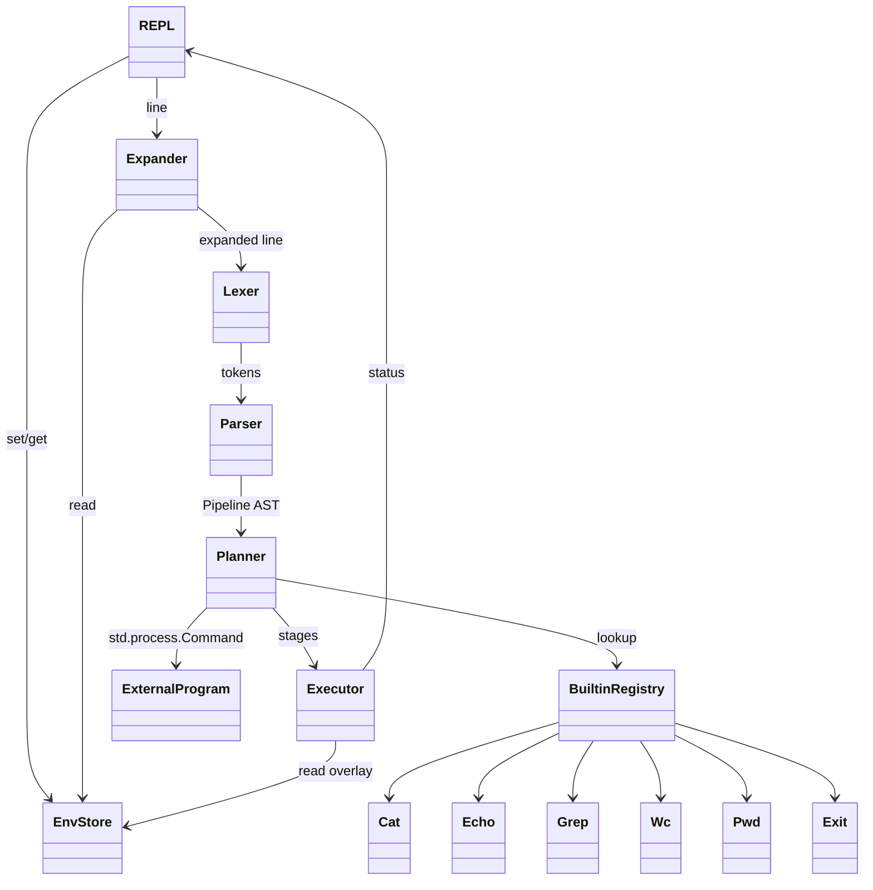

# ARCHITECTURE

Этот документ — **точка входа** в архитектуру проекта “простой CLI‑интерпретатор” на Rust.
Реализация будет в следующем задании; здесь фиксируются решения, чтобы при кодировании не приходилось “додумывать важное”.

## Цели

- **Поддерживаемые команды (builtins)**: `cat`, `echo`, `grep`, `wc`, `pwd`, `exit`.
- **Поддерживаемые возможности языка**:
  - **кавычки**: одинарные (full quoting) и двойные (weak quoting);
  - **окружение**: присваивания `NAME=value`, подстановка `$NAME`;
  - **внешние программы**: если команда не встроенная — запуск через `PATH`;
  - **пайплайны**: оператор `|` (поток stdout → stdin).
- **НФ‑требования**: легко добавлять команды; чёткие ответственности; не “клубок”, а компоненты; понятный поток исполнения.

## Не цели (явно)

Чтобы не разрастаться:
- нет `;`, `&&`, `||`, `()`/subshell, `$(...)`, backticks;
- нет globbing (`*`), tilde (`~`), редиректов (`>`, `<`), heredoc;
- нет `export`, `unset`, `cd` (кроме `pwd`);
- нет history/line-editing (используем простое чтение строк).

## Компонентная схема

## Поток выполнения (сквозной)

Для каждой введённой строки:
1. **Expander** применяет подстановки `$NAME` по правилам кавычек, возвращая строку, где `$NAME` заменены на значения.
  - На этом этапе важно, что подстановка выполняется **до токенизации**, чтобы работали случаи вроде `$x$y`.
2. **Лексер** превращает текст в поток токенов: `Word` (с учётом кавычек) и `Pipe`.
3. **Парсер** строит объектную модель: `Pipeline = [CommandSpec, ...]`.
4. **Planner/Factory** решает, чем является каждая команда: builtin или external, а также применяет правила для присваиваний окружения.
5. **Executor** соединяет стадии пайплайна потоками и выполняет их, собирая коды возврата.
6. **REPL** печатает диагностику (если нужно), сохраняет `last_status`, продолжает цикл или завершает работу по `exit`.

## Детали (коротко, но достаточно)

- **Кавычки**:
  - `'...'` (single quotes): внутри **ничего не интерпретируется**, включая `$`.
  - `"..."` (double quotes): `$NAME` **интерпретируется**, а пробелы внутри — часть аргумента.
  - кавычки — часть синтаксиса; удаляются на этапе токенизации (quote removal), после того как expander уже отработал.
- **Окружение**:
  - строка из одних присваиваний (например `x=1 y=2`) изменяет **shell environment**;
  - присваивания перед командой (например `x=1 wc file`) действуют **только для этой команды** (временное окружение).
- **Внешние команды**: если имя команды не найдено среди builtins — запускаем через `std::process::Command` и `PATH`.
- **Пайп**: `a | b | c` соединяет stdout→stdin между стадиями; стадии могут быть builtin или external.

## Документы архитектуры

- [`docs/architecture/overview.md`](architecture/overview.md) — модули/интерфейсы и как добавлять команды.
- [`docs/architecture/parsing-and-expansion.md`](architecture/parsing-and-expansion.md) — лексинг, парсинг, quoting, `$`.
- [`docs/architecture/execution.md`](architecture/execution.md) — пайплайны, stdio, коды возврата, `exit`.

## Чеклист (где что описано)

- **команды/пайплайны как объекты**: `docs/architecture/overview.md`
- **разбор входной строки**: `docs/architecture/parsing-and-expansion.md`
- **подстановка `$` и правила кавычек**: `docs/architecture/parsing-and-expansion.md`
- **“подстановка до финальной токенизации argv”**: `docs/architecture/parsing-and-expansion.md` (через `WordPartAst`)
- **хранение/модификация окружения**: `docs/architecture/parsing-and-expansion.md`
- **создание команд (builtin vs external)**: `docs/ARCHITECTURE.md` + `docs/architecture/overview.md`
- **пайпы и манипуляции stdin/stdout**: `docs/architecture/execution.md`
- **коды возврата/ошибки/127/2**: `docs/architecture/execution.md`
- **завершение по `exit`**: `docs/architecture/execution.md`

## Источники (минимально)

- Bash Reference Manual — Quoting: `https://www.gnu.org/software/bash/manual/html_node/Quoting.html`
- Bash Reference Manual — Shell Expansions (порядок и “quote removal”): `https://www.gnu.org/software/bash/manual/html_node/Shell-Expansions.html`
- Rust By Example — Pipes (`std::process`): `https://doc.rust-lang.org/rust-by-example/std_misc/process/pipe.html`
